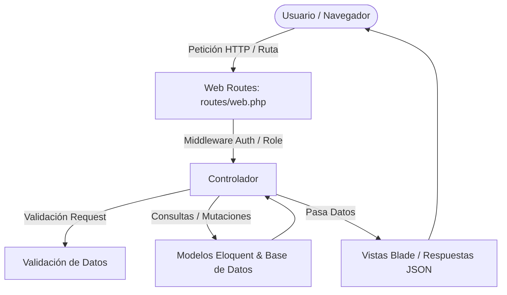

# 📚 Documentación Integral de Controladores - PowerNet Laravel

Esta documentación detalla el funcionamiento, arquitectura, métodos, rutas y lógica de negocio de cada uno de los **Controladores** (`Controllers`) del sistema e-commerce **PowerNet**.

---

## 📑 Tabla de Contenido

1. [Arquitectura y Flujo General](#1-arquitectura-y-flujo-general)
2. [Módulo de Administración](#2-módulo-de-administración)
   - [dashboardController](#21-dashboardcontroller)
   - [ProductoController](#22-productocontroller)
   - [CategoriaController](#23-categoriacontroller)
   - [ProveedorController](#24-proveedorcontroller)
   - [OfertaController](#25-ofertacontroller)
   - [AdminInventarioController](#26-admininventariocontroller)
   - [AdminPedidoController](#27-adminpedidocontroller)
   - [AdminVentaController](#28-adminventacontroller)
   - [AdminPagoController](#29-adminpagocontroller)
   - [AdminEnvioController](#210-adminenviocontroller)
   - [AdminDevolucionController](#211-admindevolucioncontroller)
3. [Módulo de Tienda y Clientes (E-commerce)](#3-módulo-de-tienda-y-clientes-e-commerce)
   - [TiendaController](#31-tiendacontroller)
   - [CarritoController](#32-carritocontroller)
   - [CheckoutController](#33-checkoutcontroller)
   - [PedidoController](#34-pedidocontroller)
   - [ClienteDevolucionController](#35-clientedevolucioncontroller)
   - [FavoritoController](#36-favoritocontroller)
   - [ClienteMetodoPagoController & MetodoPagoController](#37-metodospagocontroller)
   - [ProfileController](#38-profilecontroller)
4. [Módulo de Autenticación (`App\Http\Controllers\Auth`)](#4-módulo-de-autenticación)
5. [Resumen Rápido de Rutas y Métodos CRUD](#5-resumen-rápido-de-rutas-y-métodos-crud)

---

## 1. Arquitectura y Flujo General

En Laravel, los **Controladores** son la capa intermedia del patrón MVC (Modelo - Vista - Controlador). Su responsabilidad es:
1. **Recibir la petición HTTP** enviada por el navegador o cliente API.
2. **Validar los datos entrantes** (reglas de formulario, tipos de archivos, rangos numéricos).
3. **Interactuar con los Modelos Eloquent** (consultar, crear, actualizar o eliminar registros en la base de datos MySQL/MariaDB).
4. **Ejecutar la lógica de negocio** (cálculo de stock, descuentos, control de estados de pedidos, transacciones).
5. **Retornar una respuesta** (una vista Blade `return view(...)` o una respuesta JSON `return response()->json(...)`).



---

## 2. Módulo de Administración

Los controladores de este módulo gestionan toda la parte operativa, logística, financiera y de catálogo de PowerNet.

---

### 2.1. `dashboardController`
- **Ubicación:** `app/Http/Controllers/dashboardController.php`
- **Propósito:** Proveer el panel de control principal del administrador con métricas globales en tiempo real y la administración rápida de usuarios/roles.

#### 🛠️ Métodos Principales:
| Método | Tipo | Ruta | Descripción |
|---|---|---|---|
| `index(Request $request)` | `GET` | `/dashboard` | Calcula KPIs: Total de productos (activos/inactivos), valor total del inventario (`stock * precio`), productos con stock crítico (<= 5), total y conteo de ventas, pedidos pendientes, y lista paginada de usuarios con filtro de búsqueda. |
| `cambiarRol($id)` | `POST` | `/admin/usuarios/{id}/cambiar-rol` | Permite alternar el rol de un usuario entre Administrador (`role_id = 1`) y Cliente (`role_id = 2`), impidiendo que el administrador logueado se degrade a sí mismo. |

---

### 2.2. `ProductoController`
- **Ubicación:** `app/Http/Controllers/ProductoController.php`
- **Propósito:** Gestión completa (CRUD) de los productos de la tienda, carga múltiple de imágenes, precios de compra/venta y control de stock.

#### 🛠️ Métodos Principales:
| Método | Tipo | Ruta | Descripción |
|---|---|---|---|
| `index()` | `GET` | `/productos` | Lista todos los productos paginados con sus relaciones (categoría, imágenes, proveedor, ofertas). |
| `store(Request $request)` | `POST` | `/productos` | Valida y guarda un nuevo producto; sube y vincula múltiples imágenes en `public/imagenes_productos/`. |
| `show($id)` | `GET` | `/productos/{id}` | Retorna el detalle completo de un producto en formato JSON (ideal para modales interactivos). |
| `update(Request $request, $id)` | `PUT` | `/productos/{id}` | Actualiza datos del producto y permite agregar o modificar imágenes. |
| `destroy($id)` | `DELETE` | `/productos/{id}` | Elimina el producto y limpia los archivos de imagen físicos en el servidor. |
| `eliminarImagen($id)` | `DELETE` | `/productos/imagen/{id}` | Elimina una imagen individual asociada al producto. |

---

### 2.3. `CategoriaController`
- **Ubicación:** `app/Http/Controllers/CategoriaController.php`
- **Propósito:** Administrar las categorías en las que se clasifican los productos tecnológicos de PowerNet.

#### 🛠️ Métodos Principales:
| Método | Tipo | Descripción |
|---|---|---|
| `index()` | `GET` | Lista las categorías con el conteo de productos asociados. |
| `store(Request $request)` | `POST` | Valida el nombre/descripción y crea una nueva categoría. |
| `update(Request $request, $id)` | `PUT` | Edita los datos de la categoría seleccionada. |
| `destroy($id)` | `DELETE` | Elimina la categoría (con validación de integridad referencial si tiene productos). |

---

### 2.4. `ProveedorController`
- **Ubicación:** `app/Http/Controllers/ProveedorController.php`
- **Propósito:** Gestionar el directorio de proveedores que suministran los artículos a PowerNet (contacto, teléfono, email, dirección).

#### 🛠️ Métodos Principales:
| Método | Tipo | Descripción |
|---|---|---|
| `index()` | `GET` | Muestra la tabla de proveedores registrados. |
| `store(Request $request)` | `POST` | Registra un nuevo proveedor validando duplicidad de datos como teléfono/correo. |
| `update(Request $request, $id)` | `PUT` | Actualiza la información de contacto del proveedor. |
| `destroy($id)` | `DELETE` | Da de baja o elimina un proveedor. |

---

### 2.5. `OfertaController`
- **Ubicación:** `app/Http/Controllers/OfertaController.php`
- **Propósito:** Administrar descuentos y promociones temporales aplicados a productos específicos.

#### 🛠️ Métodos Principales:
| Método | Tipo | Descripción |
|---|---|---|
| `index()` | `GET` | Lista las ofertas activas, vencidas y programadas. |
| `store(Request $request)` | `POST` | Aplica un porcentaje de descuento o precio especial con fechas de inicio y fin. |
| `update(Request $request, $id)` | `PUT` | Modifica vigencia o porcentaje de descuento. |
| `destroy($id)` | `DELETE` | Cancela/elimina la oferta restaurando el precio base. |

---

### 2.6. `AdminInventarioController`
- **Ubicación:** `app/Http/Controllers/AdminInventarioController.php`
- **Propósito:** Control avanzado de existencias, ajustes manuales de stock (entradas/salidas), alertas de stock bajo y auditoría de movimientos de almacén.

#### 🛠️ Métodos Principales:
| Método | Tipo | Descripción |
|---|---|---|
| `index()` | `GET` | Vista del estado de inventario, stock actual y productos con stock mínimo. |
| `ajustarStock(Request $request)` | `POST` | Registra ingresos de mercancía o mermas con justificación/motivo. |
| `reporte()` | `GET` | Generación de reporte de inventario valorizado. |

---

### 2.7. `AdminPedidoController`
- **Ubicación:** `app/Http/Controllers/AdminPedidoController.php`
- **Propósito:** Administrar el ciclo de vida de los pedidos realizados por los clientes.

#### 🛠️ Métodos Principales:
| Método | Tipo | Descripción |
|---|---|---|
| `index(Request $request)` | `GET` | Lista todos los pedidos con filtros por estado (`Pendiente`, `En preparación`, `Enviado`, `Entregado`, `Cancelado`). |
| `show($id)` | `GET` | Detalle del pedido: cliente, dirección de entrega, desglose de items y comprobante de pago. |
| `actualizarEstado(Request $request, $id)` | `POST/PUT` | Cambia el estado del pedido y dispara notificaciones/actualizaciones logísticas. |

---

### 2.8. `AdminVentaController`
- **Ubicación:** `app/Http/Controllers/AdminVentaController.php`
- **Propósito:** Visualización de métricas financieras, reportes de ingresos netos y desglose histórico de transacciones completadas.

#### 🛠️ Métodos Principales:
| Método | Tipo | Descripción |
|---|---|---|
| `index(Request $request)` | `GET` | Panel de ventas con filtros de fecha (día, mes, año) y totales recaudados. |
| `exportarReporte()` | `GET` | Exportación o visualización detallada del historial de transacciones. |

---

### 2.9. `AdminPagoController`
- **Ubicación:** `app/Http/Controllers/AdminPagoController.php`
- **Propósito:** Revisión, validación y confirmación de los pagos reportados por los clientes (transferencias, comprobantes, pasarelas).

#### 🛠️ Métodos Principales:
| Método | Tipo | Descripción |
|---|---|---|
| `index()` | `GET` | Lista de pagos recibidos con estados (`Pendiente de verificación`, `Aprobado`, `Rechazado`). |
| `verificarPago(Request $request, $id)` | `POST` | Aprueba o rechaza un comprobante de pago subido por el cliente. |

---

### 2.10. `AdminEnvioController`
- **Ubicación:** `app/Http/Controllers/AdminEnvioController.php`
- **Propósito:** Asignación de números de guía, empresas de mensajería y seguimiento de los envíos despachados.

#### 🛠️ Métodos Principales:
| Método | Tipo | Descripción |
|---|---|---|
| `index()` | `GET` | Control de despachos y estado de las entregas. |
| `actualizarGuia(Request $request, $id)` | `POST` | Asigna número de tracking y transportadora al pedido. |

---

### 2.11. `AdminDevolucionController`
- **Ubicación:** `app/Http/Controllers/AdminDevolucionController.php`
- **Propósito:** Gestión de reclamos y solicitudes de garantía/devolución emitidas por clientes.

#### 🛠️ Métodos Principales:
| Método | Tipo | Descripción |
|---|---|---|
| `index()` | `GET` | Lista de solicitudes de devolución recibidas. |
| `gestionar(Request $request, $id)` | `POST` | Aprueba o rechaza la devolución, reincorporando stock si aplica. |

---

## 3. Módulo de Tienda y Clientes (E-commerce)

Este módulo atiende la experiencia del comprador: navegación del catálogo, carrito de compra, pago y seguimiento.

---

### 3.1. `TiendaController`
- **Ubicación:** `app/Http/Controllers/TiendaController.php`
- **Propósito:** Controlador público principal para la navegación de la tienda, catálogo, filtros interactivos y ficha técnica de productos.

#### 🛠️ Métodos Principales:
| Método | Tipo | Ruta | Descripción |
|---|---|---|---|
| `inicio()` | `GET` | `/` | Página principal de bienvenida con productos destacados, ofertas recientes y categorías principales. |
| `catalogo(Request $request)` | `GET` | `/tienda` o `/catalogo` | Catálogo interactivo con filtrado por categoría, rango de precios, disponibilidad y ordenamiento. |
| `detalle($id)` | `GET` | `/producto/{id}` | Ficha de detalle de producto: galería de imágenes, stock disponible, especificaciones y productos relacionados. |

---

### 3.2. `CarritoController`
- **Ubicación:** `app/Http/Controllers/CarritoController.php`
- **Propósito:** Manejo del carrito de compras (soporte tanto para sesión de invitado como para usuario autenticado).

#### 🛠️ Métodos Principales:
| Método | Tipo | Descripción |
|---|---|---|
| `index()` | `GET` | Muestra los productos añadidos al carrito, subtotales, impuestos y total a pagar. |
| `agregar(Request $request)` | `POST` | Añade un producto al carrito verificando que la cantidad solicitada no exceda el stock disponible. |
| `actualizar(Request $request)` | `POST` | Modifica la cantidad de unidades de un item del carrito. |
| `eliminar($id)` | `DELETE/POST` | Remueve un producto del carrito de compras. |
| `vaciar()` | `POST` | Limpia completamente el carrito del usuario. |

---

### 3.3. `CheckoutController`
- **Ubicación:** `app/Http/Controllers/CheckoutController.php`
- **Propósito:** Orquestación del proceso de pago: captura de dirección de envío, método de pago, validación de stock final y creación de la orden.

#### 🛠️ Métodos Principales:
| Método | Tipo | Descripción |
|---|---|---|
| `index()` | `GET` | Formulario de checkout con resumen de compra, selección de dirección y métodos de pago. |
| `procesar(Request $request)` | `POST` | Ejecuta la transacción: valida stock, descuenta inventario, crea el registro en `pedidos` y `detalle_pedidos`, asocia el pago y vacía el carrito. |
| `confirmacion($pedido_id)` | `GET` | Pantalla de agradecimiento / confirmación con el resumen de la orden generada. |

---

### 3.4. `PedidoController`
- **Ubicación:** `app/Http/Controllers/PedidoController.php`
- **Propósito:** Panel del cliente para consultar el historial de sus compras y descargar/visualizar recibos.

#### 🛠️ Métodos Principales:
| Método | Tipo | Descripción |
|---|---|---|
| `misPedidos()` | `GET` | Lista de todos los pedidos realizados por el usuario autenticado. |
| `verDetalle($id)` | `GET` | Detalle específico de un pedido perteneciente al usuario. |
| `cancelarPedido($id)` | `POST` | Permite cancelar el pedido si aún se encuentra en estado `Pendiente`. |

---

### 3.5. `ClienteDevolucionController`
- **Ubicación:** `app/Http/Controllers/ClienteDevolucionController.php`
- **Propósito:** Permitir al cliente solicitar devoluciones de pedidos entregados y adjuntar motivos o evidencias.

---

### 3.6. `FavoritoController`
- **Ubicación:** `app/Http/Controllers/FavoritoController.php`
- **Propósito:** Gestión de la lista de deseos (Wishlist) de los clientes. Permite agregar, listar y remover productos favoritos.

---

### 3.7. `MetodoPagoController` & `ClienteMetodoPagoController`
- **Ubicación:** `app/Http/Controllers/MetodoPagoController.php` y `ClienteMetodoPagoController.php`
- **Propósito:** Gestión de los métodos de pago habilitados en la plataforma (tarjetas, transferencias, contra entrega, etc.) y billeteras/métodos guardados por el cliente.

---

### 3.8. `ProfileController`
- **Ubicación:** `app/Http/Controllers/ProfileController.php`
- **Propósito:** Gestión del perfil de usuario (actualización de nombre, correo electrónico, dirección y cambio de contraseña).

---

## 4. Módulo de Autenticación (`App\Http\Controllers\Auth`)

Controladores basados en **Laravel Breeze** encargados de la seguridad y control de acceso:

| Controlador | Propósito |
|---|---|
| **`AuthenticatedSessionController`** | Maneja el inicio de sesión (`login`) y cierre de sesión (`logout`). Redirige según rol (Admin al Dashboard, Cliente a la Tienda). |
| **`RegisteredUserController`** | Registro de nuevos usuarios en la plataforma asignando por defecto el rol de Cliente (`role_id = 2`). |
| **`PasswordResetLinkController`** | Envío de correos con enlaces de recuperación de contraseña olvidada. |
| **`NewPasswordController`** | Establecimiento y guardado de la nueva contraseña recuperada. |
| **`PasswordController`** | Actualización de contraseña desde el perfil de usuario. |
| **`ConfirmablePasswordController`** | Confirmación de contraseña previa a realizar acciones sensibles. |
| **`EmailVerificationPromptController`** | Pantalla de aviso para validar correo electrónico. |
| **`VerifyEmailController`** | Validación del token de verificación de email. |
| **`EmailVerificationNotificationController`** | Reenvío de enlace de verificación. |

---

## 5. Resumen Rápido de Métodos CRUD Estándar en Laravel

En la mayoría de controladores del proyecto se siguen las convenciones RESTful de Laravel:

```text
+-----------+-----------------------+-------------------------+-----------------------------------+
| Verbo     | URI                   | Método en Controlador   | Acción que realiza                |
+-----------+-----------------------+-------------------------+-----------------------------------+
| GET       | /recurso              | index()                 | Lista todos los registros         |
| GET       | /recurso/create       | create()                | Muestra el formulario de creación |
| POST      | /recurso              | store(Request $request) | Guarda el nuevo registro          |
| GET       | /recurso/{id}         | show($id)               | Muestra un registro específico    |
| GET       | /recurso/{id}/edit    | edit($id)               | Muestra formulario de edición     |
| PUT/PATCH | /recurso/{id}         | update(Request $request)| Actualiza el registro existente   |
| DELETE    | /recurso/{id}         | destroy($id)            | Elimina el registro               |
+-----------+-----------------------+-------------------------+-----------------------------------+
```

---

> 💡 *Documento generado para el proyecto **PowerNet Laravel**.*
